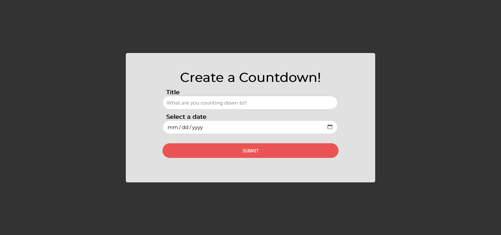
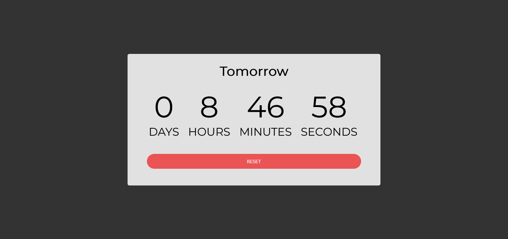
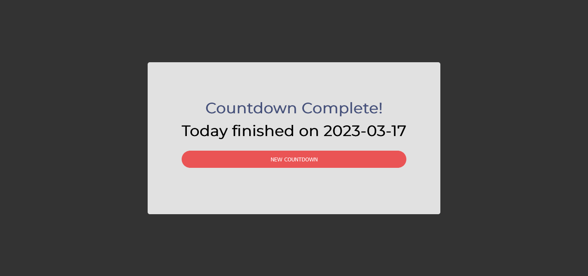

# Countdown
A customized countdown

# About
Create customozable countdowns with ease. 
## Table of contents

  - [Screenshot](#screenshot)
  - [Links](#links)
- [My process](#my-process)
  - [Built with](#built-with)
- [Author](#author)

### Screenshot

### Links

- Live Site URL: [Click here](https://kb-jr.github.io/Countdown/)

## My process

#### Interface:
- Build User interface using HTML5 and CSS custom properties. Three views were created, the visibility of these pages were toggled by changing the hidden attribute of the containing div with Javascript.
- Use the form tag to create the form
- Import font type from Google fonts API

#### Features:
 - Features include;

##### Submit to create countdown
##### Reset Countdown
##### Create New Countdown 

### Built with

- HTML5 
- CSS custom properties
- Javascript

## Author

- Github - [@Kb-Jr](https://github.com/Kb-Jr)
- Twitter - [@Joker__XL](https://www.twitter.com/Joker__XL)

